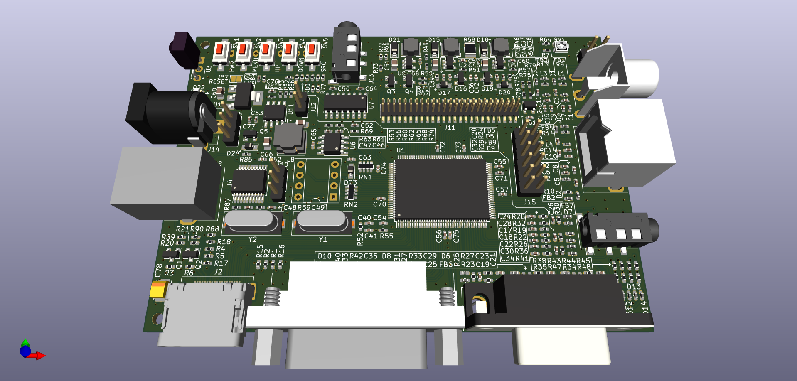
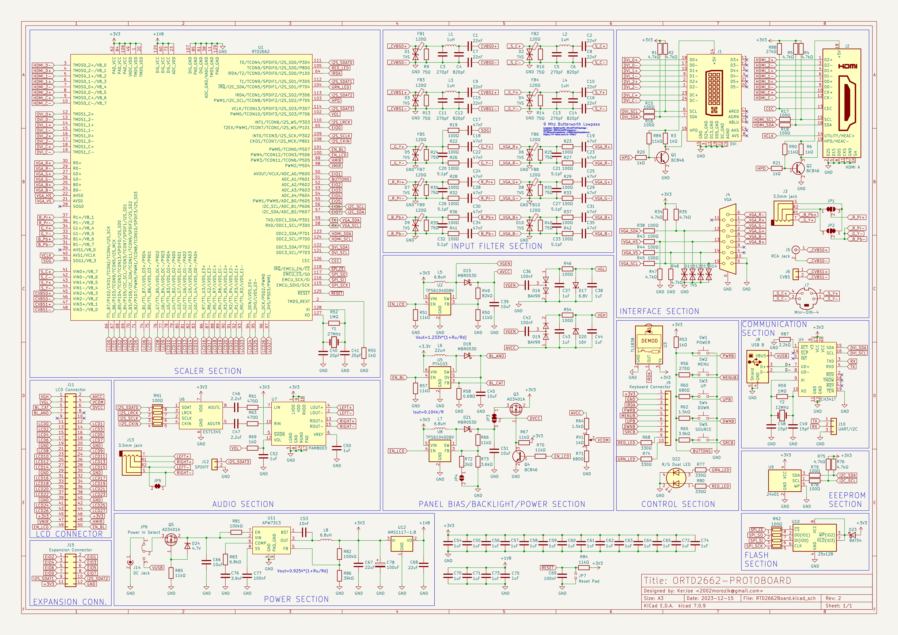

# RTD2662Board

Prototype board for developing RTD2662 firmware.

## Known problems
1. CH341 can work either in I2C or UART mode, but not both at once. If R87 is present I2C mode is enabled, otherwise the UART is used. 
The "Mods/bridgeReplacementBoard" folder contains a patch PCB using MCP2221. While it is possible to use both I2C and UART parts simultaneously, I have experienced connection problems with it's USB interface.
2. The 3.3 volt rail lacks filtering enough capacitance, so it may be necessary to add an extra 100uF electrolytic capacitor across it and ground. The C78 capacitor was added to rectify the problem, but was not tested.
3. While TPS61040 can be used for driving an LED backlight, it requires a Zener diode between "BLO_ANO" line and ground, otherwise if the screen is disconnected it will output too much voltage and self destruct. A PT4103 or similar is recommended for the U5 backlight driver.

